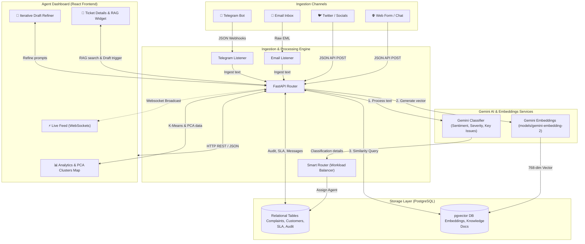

# ComplaintIQ - Project Brief & Architecture

Design and develop a Unified Customer Complaint Communication Dashboard powered by Gen-AI that aggregates complaints from all channels into a single platform. The system should use NLP and Gen-AI to automatically categorise complaints by type, product, severity, and sentiment; extract key issues; identify duplicate or related complaints; and suggest resolution templates or next-best actions. The dashboard should provide a 360-degree view of each complaint with full communication history, SLA tracking, escalation management, and regulatory reporting capabilities. Gen-AI should also enable automated draft responses for agent review, trend analysis, and root cause identification across complaint data.

---

## System Architecture & Data Flow

---

## Key Components Breakdown

### 1. Ingestion Engine
* **Listeners**: Continuously monitor incoming emails and Telegram bot webhooks/polling, and pass them to the ingestion route.
* **Smart Router**: Resolves mapping of categories to departments (`Billing`, `Technical`, `Customer Support`) and routes tickets to the agent with the lowest active workload to balance the queue.

### 2. Gen-AI & Vector Layer
* **FastAPI Routers**: Standardizes complaint intake. Triggering the **Gemini Classifier** determines metadata (Sentiment, Severity, Key Issues, regulatory warnings) in real-time.
* **pgvector Embeddings**: High-dimensional vectors are created using `models/gemini-embedding-2` (truncated to 768 dimensions) and stored in PostgreSQL. Used for finding similar historical tickets and matching relevant articles in the **RAG Knowledge Base**.

### 3. Agent UI Controls
* **Live Feed**: Receives instant server notifications of incoming issues or breaches using active WebSockets.
* **Draft Refinement**: Allows agents to modify AI draft responses iteratively by sending natural language instructions.
* **Cluster Scatter Chart**: Projects embeddings into 2D spaces using Principal Component Analysis (PCA) and visualizes them using K-Means clustering in Recharts.